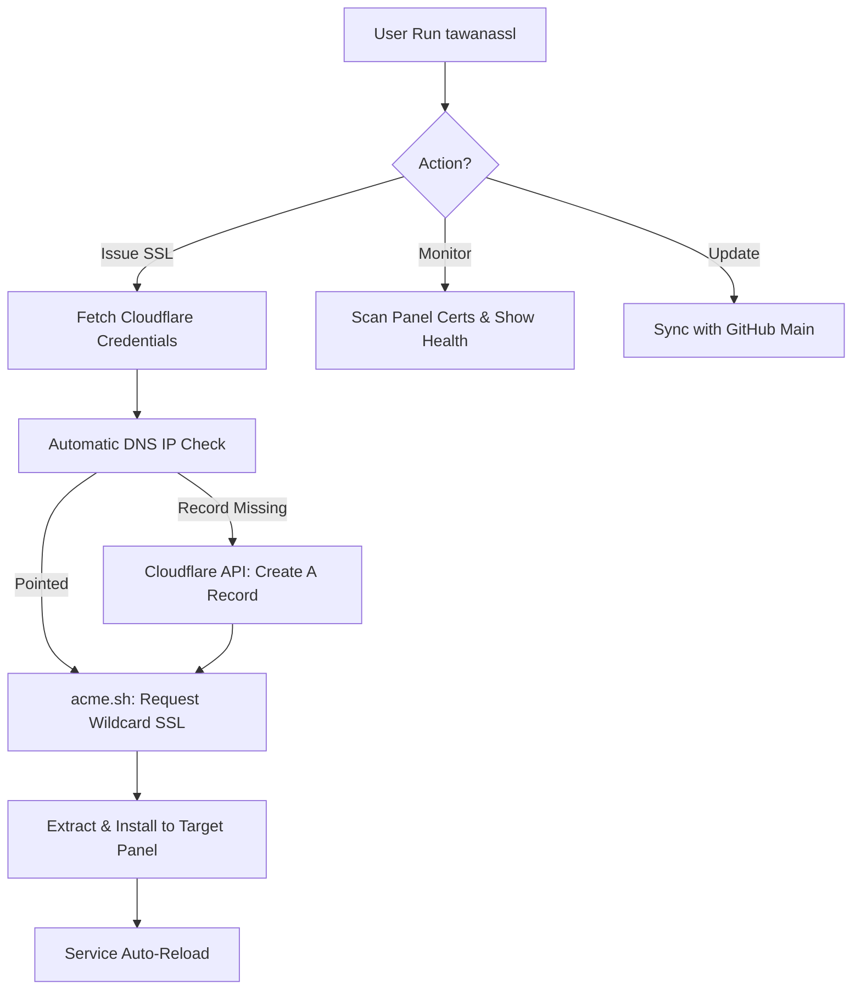

# 🔐 TawanaSSL AutoWildcard Professional Suite

<p align="center">
  
</p>

[](https://github.com/tawanamohammadi/TawanaSSL-AutoWildcard/blob/main/LICENSE)
[](https://github.com/tawanamohammadi/TawanaSSL-AutoWildcard/stargazers)
[](https://github.com/tawanamohammadi/TawanaSSL-AutoWildcard)

**TawanaSSL** is a high-performance, automated Wildcard SSL management suite. Designed for extreme censorship environments (RU, ZH, IR), it bridges the gap between complex Cloudflare DNS automation and one-click certificate deployment.

---

### 🌐 Select Language / انتخاب زبان / Выберите язык / 选择语言
[**English**](./README.md) | [**فارسی (Persian)**](./README_FA.md) | [**Русский (Russian)**](./README_RU.md) | [**简体中文 (Chinese)**](./README_ZH.md)

---

## 🚀 Why TawanaSSL?

Ordinary SSL scripts require you to manually point A-records or handle complex API calls. **TawanaSSL Elite** handles the entire lifecycle automatically.

### 💎 Key Features
- **⚡ Smart DNS Sync**: Automatically detects your server IP and creates/updates Cloudflare A-records.
- **🌪️ Global Wildcard**: Issues single certificates (`*.domain.com`) that work for unlimited sub-nodes and panels.
- **📊 Real-time Health Monitor**: Professional terminal UI with countdown timers for certificate expiration.
- **🛡️ Shield Protection**: Automatic service discovery and reload for Marzban, X-UI, Hiddify, and more.
- **🌍 Global Command**: Install once, run anywhere with the `tawanassl` command.

---

## 📐 How it Works



---

## 🛠️ Supported Panels & Paths

| Panel Name | Default Path | Restart/Reload Command |
| :--- | :--- | :--- |
| **Marzban** | `/var/lib/marzban/certs` | `systemctl restart marzban` |
| **Marzneshin** | `/var/lib/marzneshin/certs` | `systemctl restart marzneshin` |
| **Pasargad** | `/var/lib/pasarguard/certs` | `systemctl restart pasarguard` |
| **3X-UI / X-UI** | `/etc/x-ui/certs` | `x-ui restart` |
| **Hiddify** | `/opt/hiddify-manager/certs` | `hiddify-api restart` |
| **Amnezia VPN** | `/opt/amnezia/certs` | `systemctl restart amnezia-vpn` |

---

## 📦 Installation & Setup

### 1. Requirements
- **OS**: Ubuntu 20.04+ / Debian 11+ (Root access required)
- **Domain**: Must be managed by Cloudflare.
- **Credentials**: Cloudflare Email & Global API Key.

### 2. One-Liner Install
Run the magic command to install the suite globally:
```bash
sudo bash -c "$(curl -sL https://raw.githubusercontent.com/tawanamohammadi/TawanaSSL-AutoWildcard/main/setup_ssl.sh)" @ --install
```

### 3. Launch the Suite
Simply type:
```bash
tawanassl
```

---

## ❓ FAQ & Troubleshooting

**Q: Does it support ArvanCloud or other DNS providers?**
A: Currently, only Cloudflare is supported for its global reliability and powerful API.

**Q: What if my domain is already used by another server?**
A: The script will ask before updating an existing A-record. It won't overwrite anything without your permission.

**Q: Where can I find my Cloudflare API Key?**
A: Login to Cloudflare > My Profile > API Tokens > **Global API Key** (View).

---

## 🔒 Security
- **Root Protection**: Script checks for root privileges to ensure system services can be managed.
- **No Private Key Sharing**: All sensitive keys (Cloudflare Key) stay in your local environment and are never transmitted to any third-party server besides Cloudflare.

## 🤝 Community & Support
Developed for the community to fight censorship. If you found this useful, please ⭐ **Star** the repository and share it with others.

Developed with ❤️ by [**Tawana Mohammadi**](https://github.com/tawanamohammadi)
