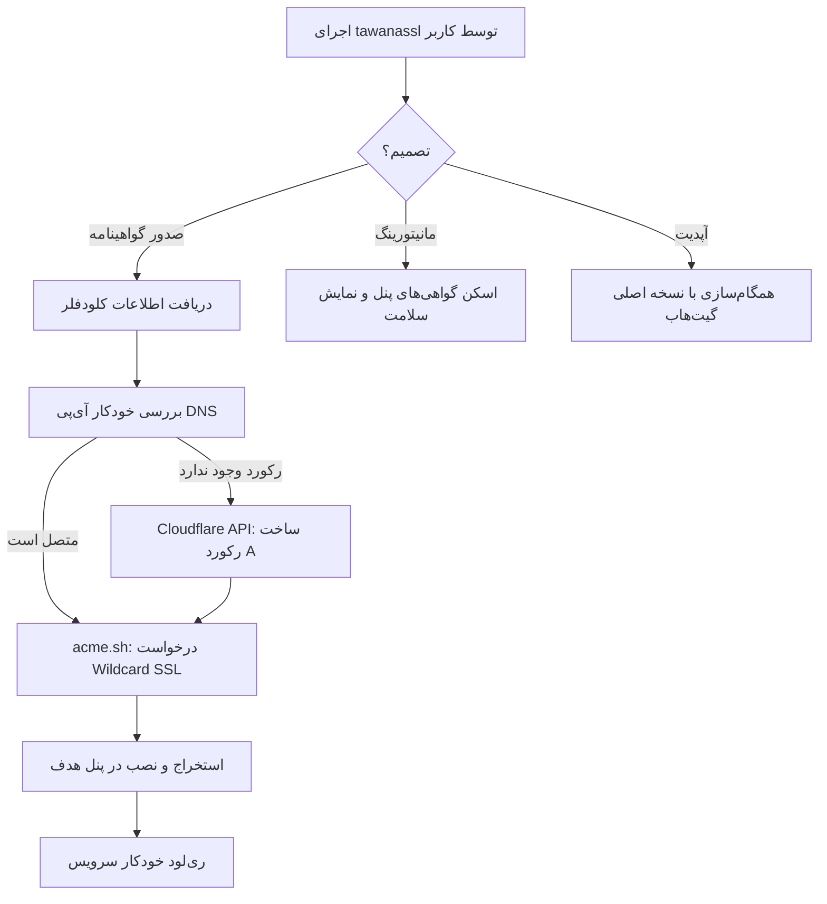

# 🔐 TawanaSSL AutoWildcard Professional Suite (فارسی)

<p align="center">
  
</p>

[](https://github.com/tawanamohammadi/TawanaSSL-AutoWildcard/blob/main/LICENSE)
[](https://github.com/tawanamohammadi/TawanaSSL-AutoWildcard/stargazers)

**TawanaSSL** پیشرفته‌ترین سوئیت خودکار مدیریت SSL در جهان است. این ابزار به طور اختصاصی برای دور زدن محدودیت‌ها در محیط‌های تحت سانسور شدید (**ایران، روسیه و چین**) طراحی شده و فاصله بین خودکارسازی پیچیده DNS کلودفلر و نصب گواهی با یک کلیک را از بین برده است.

---

### 🌐 انتخاب زبان
[**English**](./README.md) | [**فارسی (Persian)**](./README_FA.md) | [**Русский (Russian)**](./README_RU.md) | [**简体中文 (Chinese)**](./README_ZH.md)

---

## 🚀 چرا TawanaSSL؟

اسکریپت‌های معمولی از شما می‌خواهند رکوردهای A را به صورت دستی تنظیم کنید یا درگیر فراخوان‌های پیچیده API شوید. **TawanaSSL Elite** کل چرخه حیات گواهینامه را به صورت کاملاً خودکار مدیریت می‌کند.

### 💎 ویژگی‌های کلیدی
- **⚡ همگام‌سازی هوشمند DNS**: به طور خودکار آی‌پی سرور شما را تشخیص داده و رکوردهای A در کلودفلر را ساخته یا آپدیت می‌کند.
- **🌪️ سیستم Wildcard جهانی**: صدور یک گواهینامه واحد (`*.domain.com`) که برای تعداد نامحدودی از ساب‌نودها و پنل‌ها کار می‌کند.
- **📊 مانیتورینگ زنده سلامت**: رابط کاربری حرفه‌ای ترمینال با تایمرهای معکوس برای نمایش زمان دقیق انقضای گواهی‌ها.
- **🛡️ محافظت همه‌جانبه**: شناسایی هوشمند سرویس‌ها و ری‌لود خودکار برای مرزبان، X-UI، هیدیفای و غیره.
- **🌍 دستور سراسری**: یک بار نصب کنید و در هر زمان با دستور `tawanassl` برنامه را اجرا کنید.

---

## 📐 نحوه کارکرد



---

## 🛠️ پنل‌های پشتیبانی شده و مسیرها

| نام پنل | مسیر پیش‌فرض | دستور ری‌لود/ری‌استارت |
| :--- | :--- | :--- |
| **Marzban** | `/var/lib/marzban/certs` | `systemctl restart marzban` |
| **Marzneshin** | `/var/lib/marzneshin/certs` | `systemctl restart marzneshin` |
| **Pasargad** | `/var/lib/pasarguard/certs` | `systemctl restart pasarguard` |
| **3X-UI / X-UI** | `/etc/x-ui/certs` | `x-ui restart` |
| **Hiddify** | `/opt/hiddify-manager/certs` | `hiddify-api restart` |
| **Amnezia VPN** | `/opt/amnezia/certs` | `systemctl restart amnezia-vpn` |

---

## 📦 نصب و راه‌اندازی

### ۱. نیازمندی‌ها
- **سیستم‌عامل**: Ubuntu 20.04+ / Debian 11+ (دسترسی Root الزامی است)
- **دامنه**: باید توسط Cloudflare مدیریت شود.
- **اطلاعات**: ایمیل کلودفلر و Global API Key.

### ۲. نصب با یک خط دستور
اجرای دستور زیر برای نصب سراسری سوئیت:
```bash
sudo bash -c "$(curl -sL https://raw.githubusercontent.com/tawanamohammadi/TawanaSSL-AutoWildcard/main/setup_ssl.sh)" @ --install
```

### ۳. اجرا
فقط کافیست تایپ کنید:
```bash
tawanassl
```

---

## ❓ سوالات متداول و عیب‌یابی

**س: آیا از ArvanCloud یا سایر ارائه‌دهندگان DNS پشتیبانی می‌شود؟**
ج: در حال حاضر فقط Cloudflare به دلیل پایداری جهانی و API قدرتمند پشتیبانی می‌شود.

**س: اگر دامنه من قبلاً توسط سرور دیگری استفاده شده باشد چه می‌شود؟**
ج: اسکریپت قبل از آپدیت رکورد A سوال می‌پرسد. بدون اجازه شما هیچ تغییری اعمال نمی‌شود.

**س: Global API Key کلودفلر را از کجا پیدا کنم؟**
ج: وارد پنل کلودفلر شوید > My Profile > API Tokens > بخش **Global API Key** (View).

---

## 🔒 امنیت
- **محافظت ریشه (Root)**: اسکریپت دسترسی ریشه را چک می‌کند تا از مدیریت صحیح سرویس‌های سیستم مطمئن شود.
- **عدم اشتراک‌گذاری کلیدها**: تمام کلیدهای حساس (مثل کلید کلودفلر) در محیط لوکال سرور شما باقی می‌مانند و به هیچ سرور ثالثی جز کلودفلر ارسال نمی‌شوند.

## 🤝 حمایت و جامعه کاربری
این پروژه برای مبارزه با سانسور و کمک به جامعه کاربری توسعه داده شده است. اگر این ابزار برایتان مفید بوده، لطفاً با ⭐ **Star** دادن به مخزن، از آن حمایت کنید.

توسعه داده شده با ❤️ توسط [**توانا محمدی**](https://github.com/tawanamohammadi)
