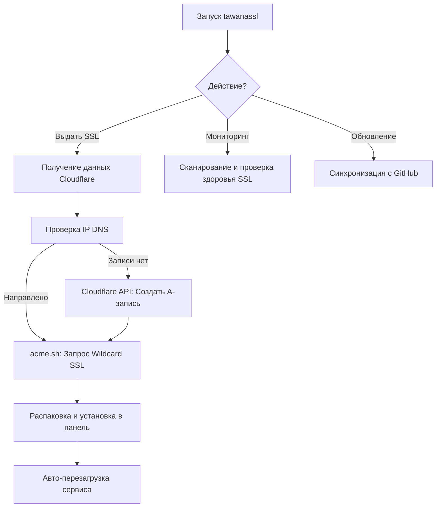

# 🔐 TawanaSSL AutoWildcard Professional Suite (Русский)

<p align="center">
  
</p>

[](https://github.com/tawanamohammadi/TawanaSSL-AutoWildcard/blob/main/LICENSE)
[](https://github.com/tawanamohammadi/TawanaSSL-AutoWildcard/stargazers)

**TawanaSSL** — это высокопроизводительный автоматизированный комплекс управления Wildcard SSL. Разработанный для обхода жесткой цензуры (Россия, Китай, Иран), он устраняет разрыв между сложной автоматизацией Cloudflare DNS и установкой сертификатов в один клик.

---

### 🌐 Выбор языка
[**English**](./README.md) | [**فارسی (Persian)**](./README_FA.md) | [**Русский (Russian)**](./README_RU.md) | [**简体中文 (Chinese)**](./README_ZH.md)

---

## 🚀 Почему TawanaSSL?

Обычные SSL-скрипты требуют ручной настройки A-записей или работы с API. **TawanaSSL Elite** полностью автоматизирует весь цикл управления сертификатами.

### 💎 Основные возможности
- **⚡ Умная синхронизация DNS**: Автоматически определяет IP вашего сервера и создает/обновляет A-записи в Cloudflare.
- **🌪️ Глобальный Wildcard**: Выдает один сертификат (`*.domain.com`), работающий для неограниченного количества подузлов и панелей.
- **📊 Мониторинг здоровья в реальном времени**: Профессиональный интерфейс терминала с обратным отсчетом срока действия сертификатов.
- **🛡️ Комплексная защита**: Интеллектуальное обнаружение сервисов и автоматическая перезагрузка для Marzban, X-UI, Hiddify и др.
- **🌍 Глобальная команда**: Установите один раз и запускайте в любое время командой `tawanassl`.

---

## 📐 Как это работает



---

## 🛠️ Поддерживаемые панели и пути

| Панель | Путь по умолчанию | Команда перезагрузки |
| :--- | :--- | :--- |
| **Marzban** | `/var/lib/marzban/certs` | `systemctl restart marzban` |
| **Marzneshin** | `/var/lib/marzneshin/certs` | `systemctl restart marzneshin` |
| **Pasargad** | `/var/lib/pasarguard/certs` | `systemctl restart pasarguard` |
| **3X-UI / X-UI** | `/etc/x-ui/certs` | `x-ui restart` |
| **Hiddify** | `/opt/hiddify-manager/certs` | `hiddify-api restart` |
| **Amnezia VPN** | `/opt/amnezia/certs` | `systemctl restart amnezia-vpn` |

---

## 📦 Установка и настройка

### 1. Требования
- **ОС**: Ubuntu 20.04+ / Debian 11+ (Root-доступ обязателен)
- **Домен**: Должен управляться через Cloudflare.
- **Данные**: Cloudflare Email и Global API Key.

### 2. Быстрая установка
Выполните команду для глобальной установки:
```bash
sudo bash -c "$(curl -sL https://raw.githubusercontent.com/tawanamohammadi/TawanaSSL-AutoWildcard/main/setup_ssl.sh)" @ --install
```

### 3. Запуск
Просто введите:
```bash
tawanassl
```

---

## ❓ FAQ и решение проблем

**В: Поддерживаются ли ArvanCloud или другие DNS-провайдеры?**
О: На данный момент поддерживается только Cloudflare из-за его надежности и мощного API.

**В: Что если мой домен уже используется другим сервером?**
О: Скрипт спросит разрешение перед обновлением A-записи. Он ничего не перезапишет без вашего согласия.

**В: Где найти Cloudflare API Key?**
О: Войдите в Cloudflare > My Profile > API Tokens > **Global API Key** (View).

---

## 🔒 Безопасность
- **Контроль Root**: Скрипт проверяет наличие прав администратора для управления системными службами.
- **Безопасность ключей**: Все конфиденциальные ключи остаются на вашем локальном сервере и передаются только в Cloudflare.

## 🤝 Сообщество и поддержка
Проект создан для борьбы с цензурой. Если этот инструмент был вам полезен, пожалуйста, поставьте ⭐ **Star** нашему репозиторию.

Разработано с ❤️ [**Tawana Mohammadi**](https://github.com/tawanamohammadi)
