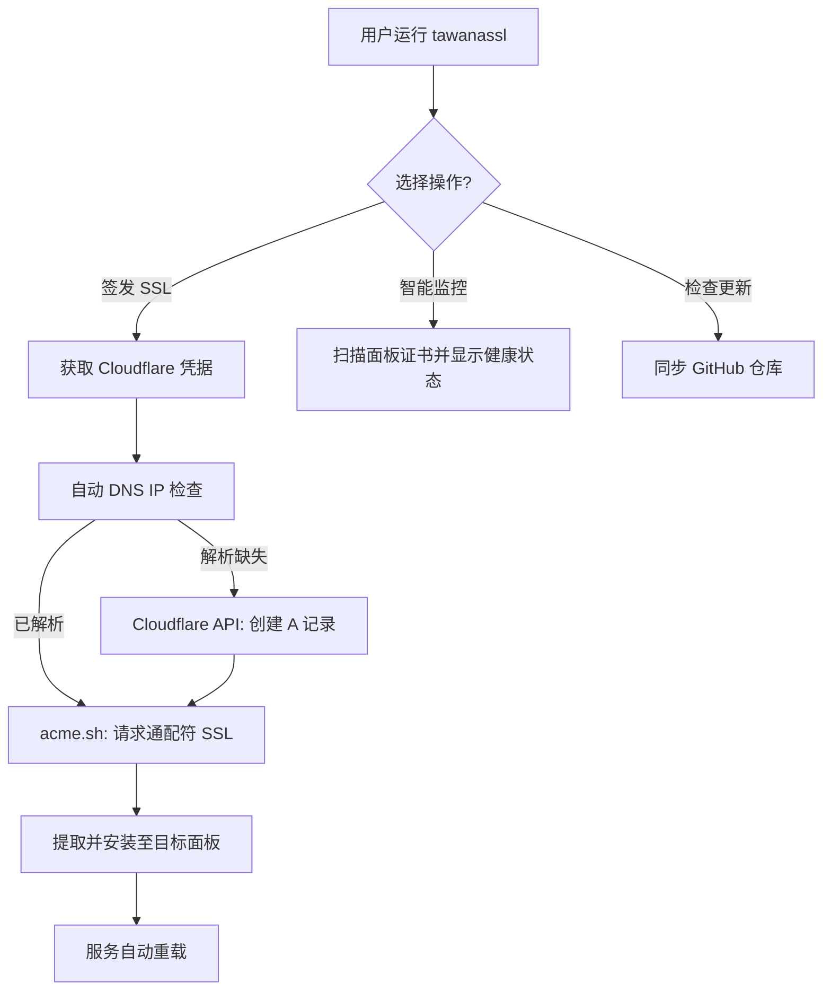

# 🔐 TawanaSSL AutoWildcard Professional Suite (简体中文)

<p align="center">
  
</p>

[](https://github.com/tawanamohammadi/TawanaSSL-AutoWildcard/blob/main/LICENSE)
[](https://github.com/tawanamohammadi/TawanaSSL-AutoWildcard/stargazers)

**TawanaSSL** 是一款高性能、自动化的通配符 (Wildcard) SSL 管理套件。专为中国、俄罗斯、伊朗等高强度审查环境设计，完美解决了复杂 Cloudflare DNS 自动化与一键证书部署之间的难题。

---

### 🌐 选择语言
[**English**](./README.md) | [**فارسی (Persian)**](./README_FA.md) | [**Русский (Russian)**](./README_RU.md) | [**简体中文 (Chinese)**](./README_ZH.md)

---

## 🚀 为什么选择 TawanaSSL?

普通的 SSL 脚本通常需要您手动配置 A 记录或处理复杂的 API 调用。**TawanaSSL Elite** 自动处理整个证书生命周期。

### 💎 核心功能
- **⚡ 智能 DNS 同步**: 自动检测服务器 IP 并创建/更新 Cloudflare A 记录。
- **🌪️ 全球通配符**: 签发单个证书 (`*.domain.com`)，适用于无限量子节点和面板。
- **📊 实时健康监控**: 专业终端 UI，带证书到期倒计时提醒。
- **🛡️ 自动服务重载**: 智能识别并自动重启 Marzban, X-UI, Hiddify 等服务。
- **🌍 全局命令**: 一次安装，随时通过 `tawanassl` 命令运行。

---

## 📐 工作原理



---

## 🛠️ 支持的面板及路径

| 面板名称 | 默认路径 | 重启/重载命令 |
| :--- | :--- | :--- |
| **Marzban** | `/var/lib/marzban/certs` | `systemctl restart marzban` |
| **Marzneshin** | `/var/lib/marzneshin/certs` | `systemctl restart marzneshin` |
| **Pasargad** | `/var/lib/pasarguard/certs` | `systemctl restart pasarguard` |
| **3X-UI / X-UI** | `/etc/x-ui/certs` | `x-ui restart` |
| **Hiddify** | `/opt/hiddify-manager/certs` | `hiddify-api restart` |
| **Amnezia VPN** | `/opt/amnezia/certs` | `systemctl restart amnezia-vpn` |

---

## 📦 安装与设置

### 1. 环境要求
- **操作系统**: Ubuntu 20.04+ / Debian 11+ (需要 Root 权限)
- **域名**: 必须由 Cloudflare 管理。
- **凭据**: Cloudflare 邮箱及 Global API Key。

### 2. 一键安装
运行以下命令进行全局安装：
```bash
sudo bash -c "$(curl -sL https://raw.githubusercontent.com/tawanamohammadi/TawanaSSL-AutoWildcard/main/setup_ssl.sh)" @ --install
```

### 3. 运行套件
只需输入：
```bash
tawanassl
```

---

## ❓ 常见问题与故障排除

**Q: 是否支持 ArvanCloud 或其他 DNS 服务商？**
A: 目前仅支持 Cloudflare，因其全球稳定性及强大的 API 支持。

**Q: 如果我的域名已被其他服务器占用怎么办？**
A: 在更新现有 A 记录之前，脚本会询问您的意见，未经许可不会覆盖。

**Q: 在哪里找到 Cloudflare API Key?**
A: 登录 Cloudflare > My Profile (个人资料) > API Tokens > **Global API Key** (查看)。

---

## 🔒 安全性
- **Root 权限保护**: 脚本会检查 Root 权限，确保能正确管理系统服务。
- **凭据安全**: 所有敏感信息（如 Cloudflare Key）仅保留在您的服务器本地，不会传输至除 Cloudflare 以外的第三方服务器。

## 🤝 社区支持
本项目旨在对抗审查，服务社区。如果您觉得有用，请 ⭐ **Star** 本仓库并分享给他人。

由 [**Tawana Mohammadi**](https://github.com/tawanamohammadi) 用 ❤️ 开发
